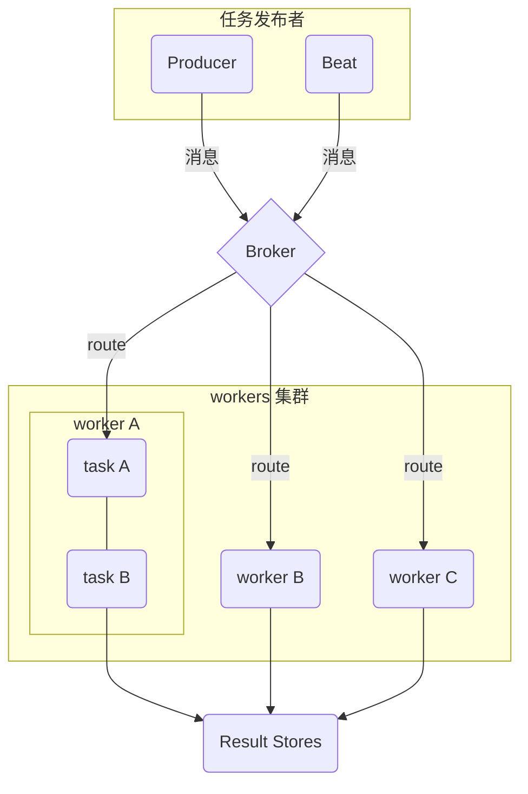
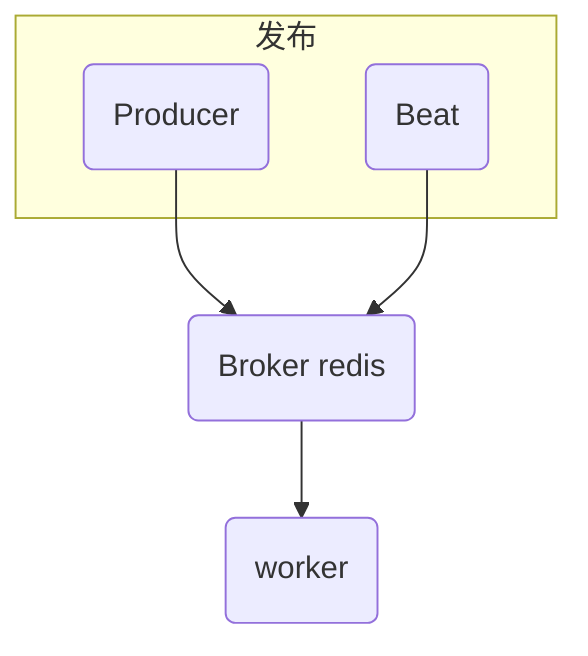
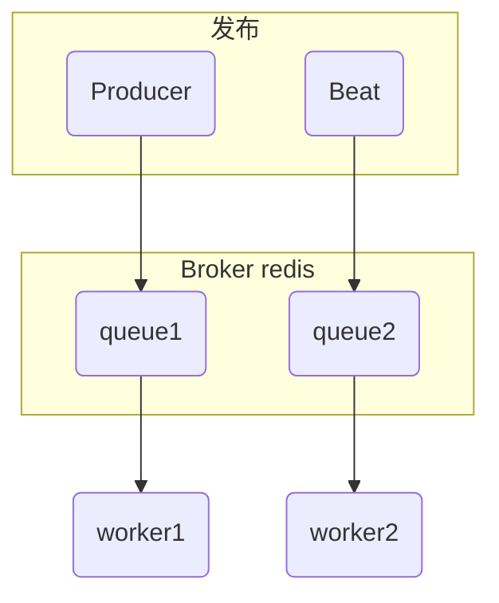
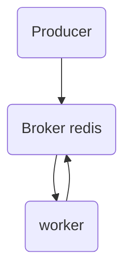

## 基础概念

### 同步

调用某个东西是，调用方得等待这个调用返回结果才能继续往后执行

比如发起一个请求, 需要等到这个请求回来之后才能继续执行后面的代码;

### 异步

调用方不会立即得到结果，而是在调用发出后调用者可用继续执行后续操作，被调用者通过状体来通知调用者，或者通过回掉函数来处理这个调用方

比如发起一个请求, 之后不再管这个请求是否已经成功, 从而再去发另一个请求或者是继续执行后面的代码; 刚才的请求是否成功由另外一个服务监听是否成功, 然后再通知到我们之后再处理跟这个请求返回的结果有关的代码.

## celery的基本组成

Celery 是一个专注于实时处理和任务调度的分布式任务队列, 同时提供操作和维护分布式系统所需的工具.. 所谓任务就是消息, 消息中的有效载荷中包含要执行任务需要的全部数据.

Celery 是一个分布式队列的管理工具, 可以用 Celery 提供的接口快速实现并管理一个分布式的任务队列.

Celery 本身不是任务队列, 是管理分布式任务队列的工具. 它封装了操作常见任务队列的各种操作, 我们使用它可以快速进行任务队列的使用与管理.

### Producer

任务生产者. 调用 Celery API , 函数或者装饰器, 而产生任务并交给任务队列处理的都是任务生产者.

### Worker

执行任务的消费者

### Broker

消息代理, 队列本身. 也称为消息中间件. 接受任务生产者发送过来的任务消息, 存进队列再按序分发给任务消费方(通常是消息队列或者数据库).

### Task

任务. 即消费者真正消费的任务

### Celery执行流程图



## 定时任务

定时执行某一个任务

### Celery Beat

celery 支持在配置中定义定时任务. 我们的使用场景中, 因为需要增量添加定时任务, 所以引入了`django_celery_beat`

django_celery_beat 在原有的beat上调度中添加了数据库, 可以通过在数据库中增加记录来定义需要的定时任务;

### Beat 调度机制

我认为beat本身可以理解为一个 worker, 他里面只有一个无限循环的 task 用来分发配置中定义的定时任务到对应的 worker 中.

```python
class Service(object):
    """Celery periodic task service."""

    """
    ......
    """
    def start(self, embedded_process=False):
        info('beat: Starting...')
        debug('beat: Ticking with max interval->%s',
              humanize_seconds(self.scheduler.max_interval))

        signals.beat_init.send(sender=self)
        if embedded_process:
            signals.beat_embedded_init.send(sender=self)
            platforms.set_process_title('celery beat')

        try:
            while not self._is_shutdown.is_set():
                interval = self.scheduler.tick()
                if interval and interval > 0.0:
                    debug('beat: Waking up %s.',
                          humanize_seconds(interval, prefix='in '))
                    time.sleep(interval)
                    if self.scheduler.should_sync():
                        self.scheduler._do_sync()
        except (KeyboardInterrupt, SystemExit):
            self._is_shutdown.set()
        finally:
            self.sync()
            
    """
  	......
  	"""
```

可以看到上面的 `start` 函数中的循环除了这行代码外 `interval = self.scheduler.tick()`  做的别的事情都可以忽略, 实际上定时任务的循环以及调度都是在这个函数中进行的.

```python
class Scheduler(object):
  	"""
  	......
  	"""

    def populate_heap(self, event_t=event_t, heapify=heapq.heapify):
        """Populate the heap with the data contained in the schedule."""
        priority = 5
        self._heap = []
        for entry in values(self.schedule):
            is_due, next_call_delay = entry.is_due()
            self._heap.append(event_t(
                self._when(
                    entry,
                    0 if is_due else next_call_delay
                ) or 0,
                priority, entry
            ))
        heapify(self._heap)
    
    # pylint disable=redefined-outer-name
    def tick(self, event_t=event_t, min=min, heappop=heapq.heappop,
             heappush=heapq.heappush):
        """Run a tick - one iteration of the scheduler.

        Executes one due task per call.

        Returns:
            float: preferred delay in seconds for next call.
        """
        adjust = self.adjust
        max_interval = self.max_interval

        if (self._heap is None or
                not self.schedules_equal(self.old_schedulers, self.schedule)):
            self.old_schedulers = copy.copy(self.schedule)
            self.populate_heap()

        H = self._heap

        if not H:
            return max_interval

        event = H[0]
        entry = event[2]
        debug("---H[0]----")
        debug(entry)
        debug("--------")
        is_due, next_time_to_run = self.is_due(entry)
        if is_due:
            verify = heappop(H)
            if verify is event:
                next_entry = self.reserve(entry)
                self.apply_entry(entry, producer=self.producer)
                heappush(H, event_t(self._when(next_entry, next_time_to_run),
                                    event[1], next_entry))
                return 0
            else:
                debug("---verify not is event: verify----")
                debug(verify)
                debug("--------")
                heappush(H, verify)
                return min(verify[0], max_interval)
        return min(adjust(next_time_to_run) or max_interval, max_interval)
                
    """
  	......
  	"""
```

看到这里实际上可以发现, beat 是将所有的定时任务进行了最小堆排序, 判断堆最上面的那条记录是否执行。

```python
"""
最小堆排序示例代码
"""
import random
from heapq import heapify


lis = list(range(150000))
random.shuffle(lis)
print("shuffle: ------")
print(lis[:100])

print("heapify: -----")
heapify(lis)
print(lis[:100])
```


## 实际开发中的问题

### 由 Producer 发布的任务迟迟得不到执行

这个问题当时排查发现是因为我们只用了一个 worker 去处理所有的任务, 而且使用 redis 做 broker 不支持优先级的设定导致



为了解决这个问题, 采用了通过配置路由启动不同的 worker, 将不同类型的任务放入对应的队列中由特定的 worker 去执行来解决。



### 定时任务每次触发都有很长的延迟

这个延迟问题, 经过排查, 我们定位到了 Beat 的最小堆排序上面;

我们的定时任务是对某一条指标的更新进行监控, 现在被监控的数据大概是在 15万 左右，每条指标的间隔是 10s;

其实这里耗时的操作已经出来, 虽然现在的数据量还不大, 但是随着时间的累计这个数量会越来越大. 导致延时越来越长

然后这对这个问题大概有三个方案:

- 自己做调度
- 分库分表, 启动多个beat
- 偷换概念, 将定时任务改成延时任务

#### 自己做调度:

目前找到的定时任务调度的算法不外乎 最小堆以及时间轮 算法; 自己调度在依旧用最小堆的前提下, 将任务分批, 一次执行一批任务, 减少定时任务本身的基数

#### 多个beat

多个beat本质也是在减少定时任务的基数, 在`django_celery_beat`的基础上扩展出来多张表分别去处理不同的定时任务; 这两种方法实际上只是治标不治本. 虽然现在得到了减少, 但是后面数据量还是会上去。

#### 延时任务

延时任务本质上是自己调用自己, 这样实际上将beat上的压力分散到了不同的 worker 上, 而且利用 Broker 本事的过期时间的机制, 避免了最小堆排序的时间损耗, 所以我们在新功能中所需要用到定时任务的地方换成了这种方式;



在开发的过程中遇到两个问题:

- 要保证worker可以把下次消息放入Broker

  - 加入 try finally, 确保可以将消息再次放入 Broker(Redis)

- 如何保证 程序终止/服务宕机 后, 再次启动服务可以得到之前已经在循环调用的 task

  - 这里的 task 实际分两部分: 一部分是在 redis 中等待执行的消息, 一部分是正在 worker 中执行的消息;

  - redis 本身是有自己的持久化的机制, 宕机问题, 实际上对已经在队列中等待的task来说是没有什么问题的, 如果redis出现数据丢失的问题, 需要去考虑 redis 主从同步等容灾措施

  - 另一部分正在worker中执行的消息怎么办？

    这部分消息, 也要分两种情况来说, 一种是正常重启worker; 另一种是宕机; 

    重启 worker 这种情况, celery 实际上做了措施, 会等 worker 中的任务执行完毕后再关闭退出, 这就是有时候 重启后端服务 jenkins会略慢的原因之一;

    宕机这种情况, 实际比较恐怖, 没有给 celery 做这种措施的时间, 所以这部分消息在下次重启的时候便再也找不到了; 所以需要为这种情况做一次数据的备份以及重启时的恢复;

  - RabbitMQ ACK(消息确认) 的可靠

    如果用 RabbitMQ 的话因为 ACK 的机制, 实际上就没有了上述问题, 只需要考虑他本身持久化的问题

    ```mermaid
    sequenceDiagram
    	participant q as queue
    	participant w as worker
    	q ->>+ w: ack
    	w ->>- q: ack
    	
    	
    ```

    